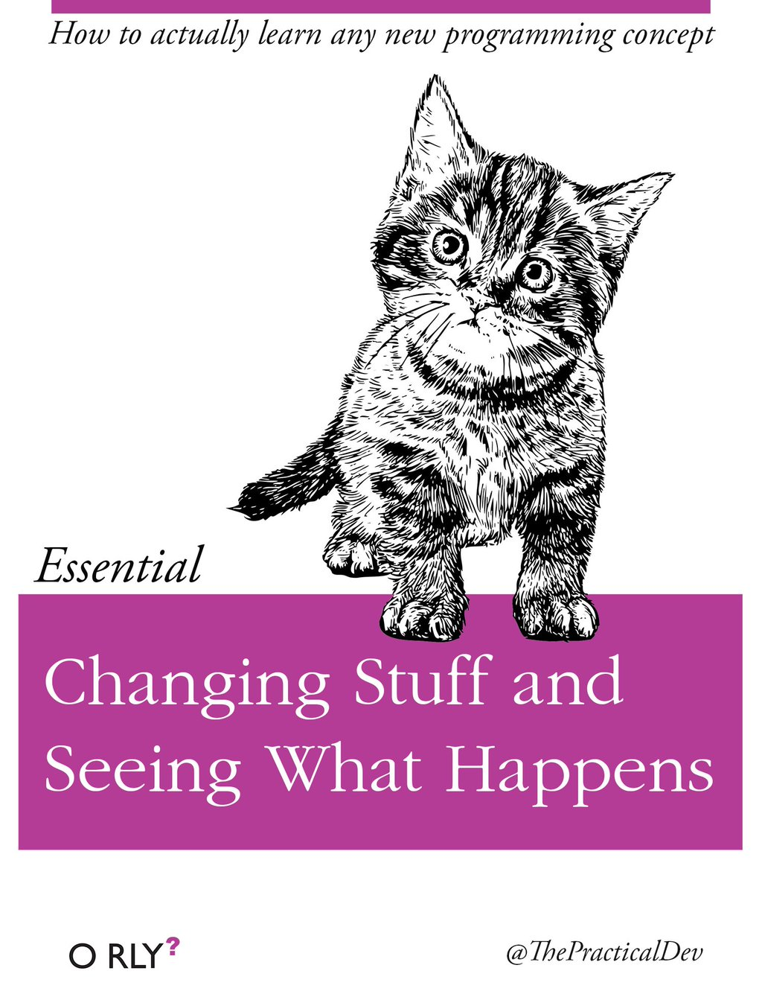


---

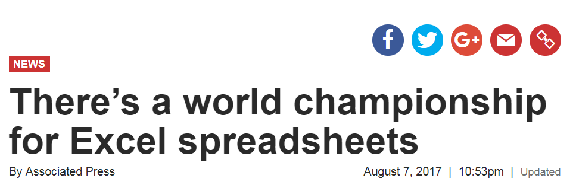

---
#  Considerations before you start in Excel 

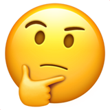


---
#  Don’t Try to Copy Everything 


---


---
#  navigation 


---

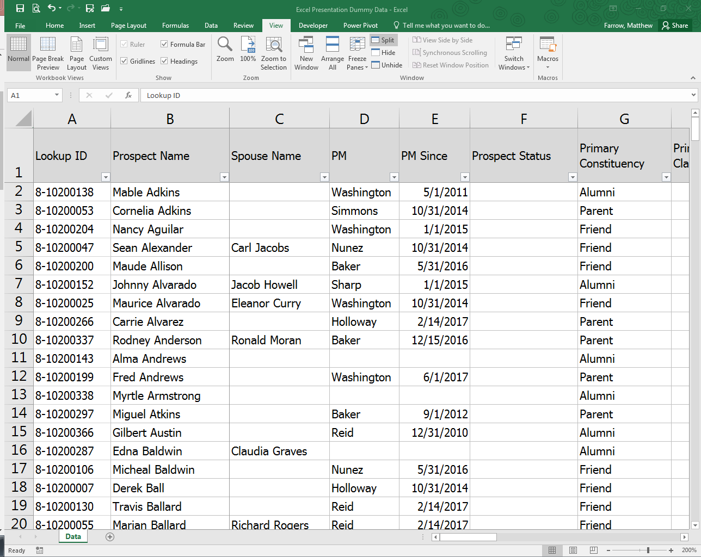


---

.pull-left[]

.pull-right[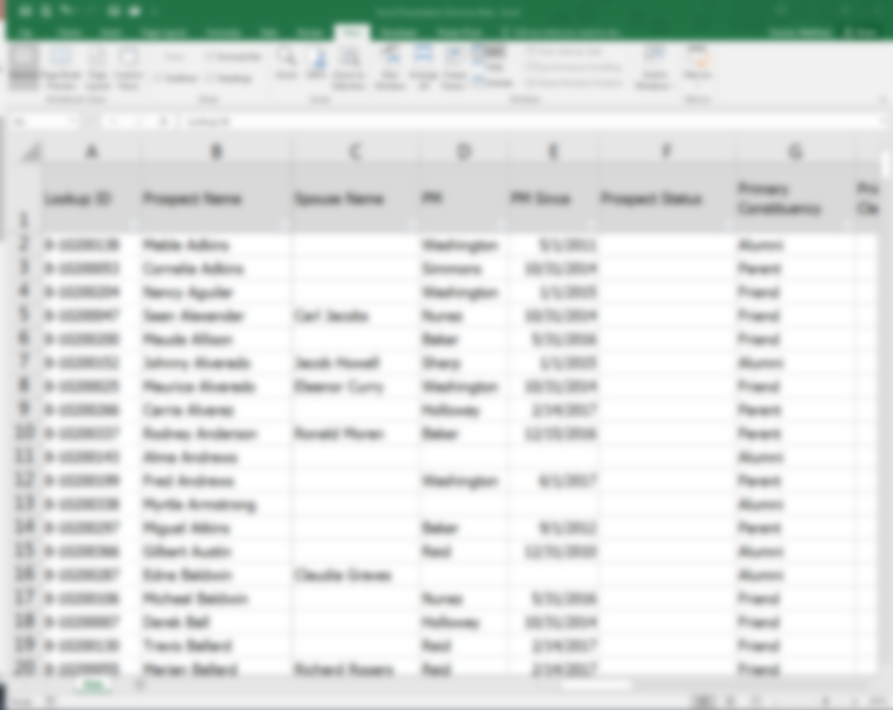]


---

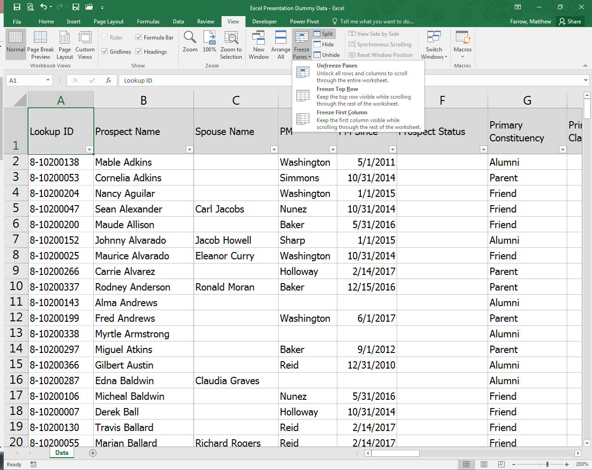


---

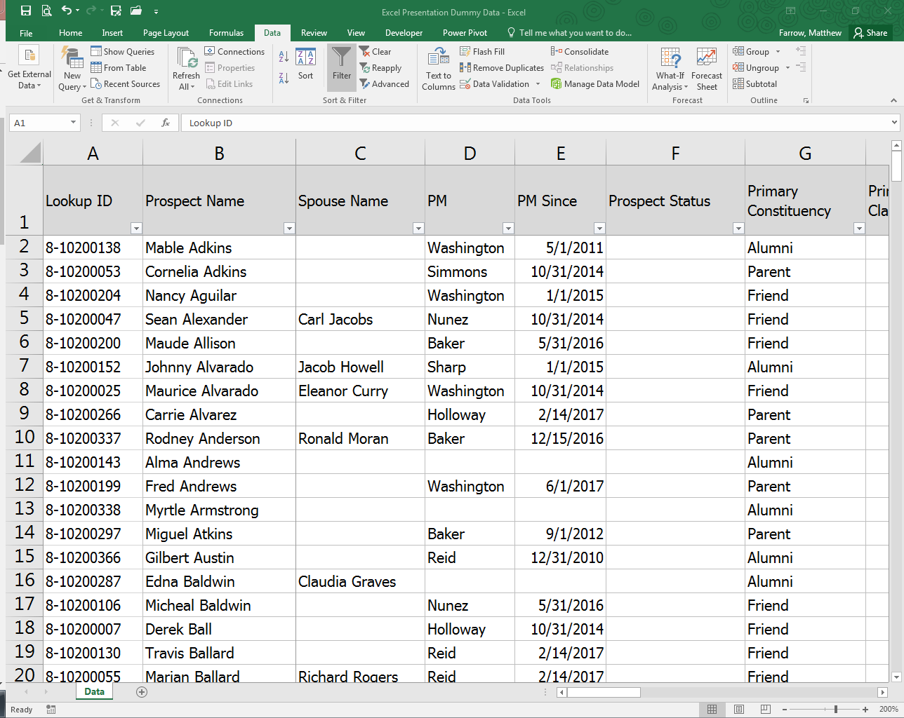


---

.pull-left[]

.pull-right[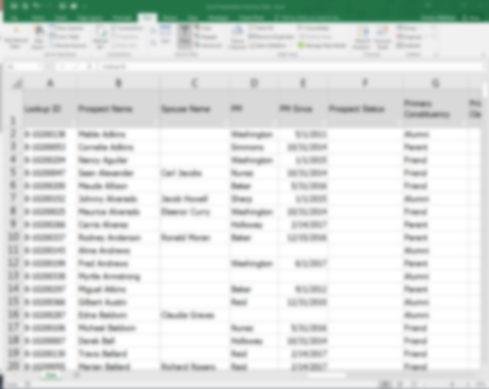]


---

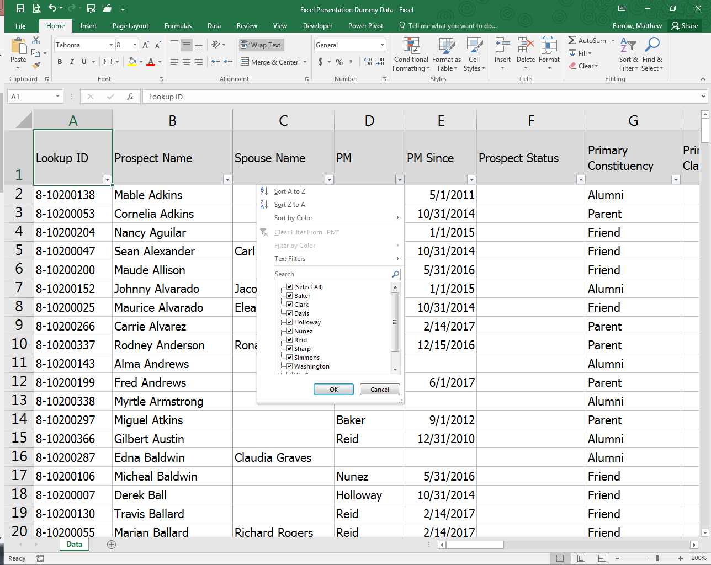


---


---


---


---


---


---
#  formulas 

+ “A formula performs calculations or other actions on the data in your worksheet .”
+ *Microsoft Support*

---


---


---


```{r tbl21, echo = FALSE}
tbl21 <- tibble::tribble(
~`$A$2`, ~`The column and the row do not change when copied.`,
"A$2","The row does not change when copied.",
"$A2","The column does not change when copied."
)

kableExtra::kable_styling(knitr::kable(tbl21), font_size = 18)
```


---


---


---


---


---


---
#  macros 

+ “A macro is an action or a set of actions that you can run as many times as you want .”
+ *Microsoft Support*


---

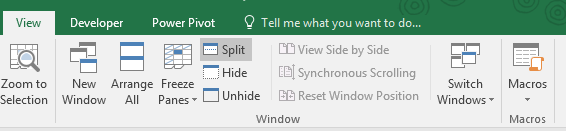

---
#  pivot tables 

+ “PivotTables are a great way to summarize, analyze, explore, and present your data, and you can create them with just a few clicks .”
+ *Microsoft Support*


---

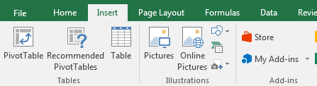

---

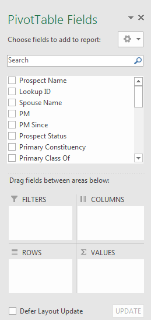

---

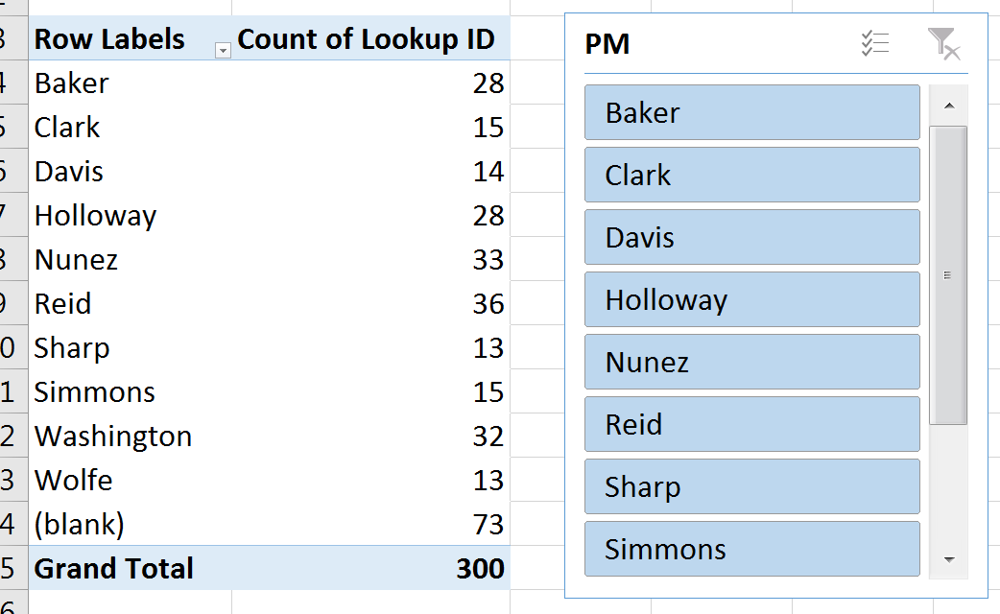


---


---

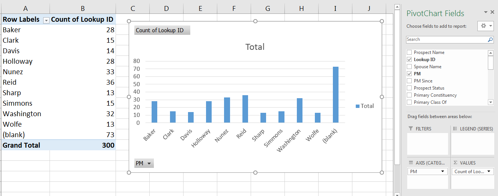

---

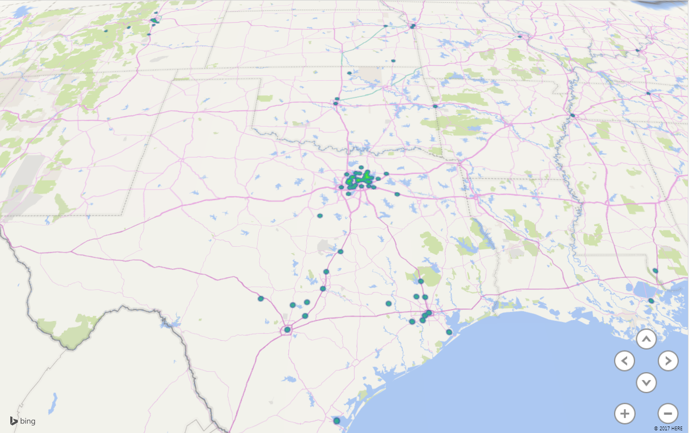

---


---


---

.pull-left[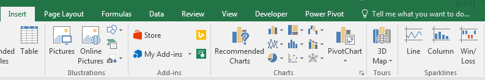]

.pull-right[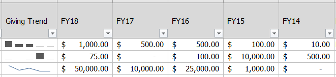]

---


---


---


---

