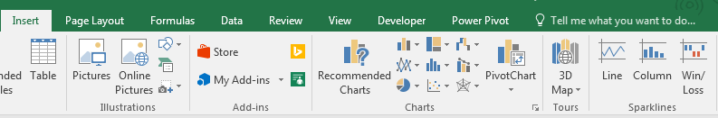

class: middle

.pull-left[

# What I feel qualified to teach.

]

.pull-right[


]

---

class: center, middle
background-color: #F56D0B

# seriously.


---

class: center, middle

#  **Considerations before you start in Excel**


---

class: center, middle

#  Don’t Try to Copy Everything


---

class: center, middle
background-image: url("images/image5.jpg")

## navigation
## manipulation
## visualization

---

class: center, middle
background-image: url("images/image6.jpg")

#  <font color="red">navigation</font>

---

# window management


--


--


---

# filters


---

# filters


---

class: center, middle
background-image: url("images/image13.jpg")

# Manipulation

---

class: center, middle 

#  formulas 

“A formula performs calculations or other actions on the data in your worksheet.”

*Microsoft Support*

---

# vlookup

=**VLOOKUP**(<font color="red">Value to look up</font>, <font color="blue">Range to look for value</font>,
<font color="orange">Column for the return value</font>, <font color="green">Type of match</font>)

=VLOOKUP(<font color="red">A1</font>, <font color="blue">Lookup!A1:B7</font>, <font color="orange">2</font>, <font color="green">TRUE</font>)

---

# absolute/relative references

Relative references **can** move.

A1

Absolute references **can't** move.

$A$1

---

# absolute/relative references

```{r tbl21, echo = FALSE}
tbl21 <- tibble::tribble(
~`$A$2`, ~`The column and the row do not change when copied.`,
"A$2","The row does not change when copied.",
"$A2","The column does not change when copied."
)

kableExtra::kable_styling(knitr::kable(tbl21), font_size = 18)
```

---

# countif

=**COUNTIF**(<font color="red">Where are we looking?</font>, <font color="blue">What are we looking for?</font>)

=COUNTIF(<font color="red">A:A</font>, <font color="blue">"Washington"</font>)

---

# concatenate

=**CONCATENATE**(<font color="red">1st Cell</font>, <font color="blue">Separator</font>, <font color="orange">2nd cell</font>, ...)

=COUNTIF(<font color="red">A1</font>, <font color="blue">" "</font>, <font color="orange">"B2"</font>, C2)

---

# date difference

.pull-left[

=**DATEDIF**(<font color="red">Start date</font>, <font color="blue">End date</font>, <font color="orange">Difference calculation</font>, ...)

=DATEDIF(<font color="red">A1</font>, <font color="blue">"A2"</font>, <font color="orange">"d"</font>)

]

.pull-right[

- Today's date: today()
- Difference in days: "d"
- Difference in weeks: ..."d")/7
- Difference in months: "m"
- Difference in years: "y"

]

---

# if

=**IF**(<font color="red">logical test</font>, <font color="blue">value if true</font>, <font color="orange">value if false</font>, ...)

=IF(<font color="red">A1=B1</font>, <font color="blue">"Match"</font>, <font color="orange">"No Match"</font>)

---

# other tricks

**Extract date element**
=YEAR(A1)

**Generate random number between 0 and 1**
=RAND()

---

#  macros 

“A macro is an action or a set of actions that you can run as many times as you want.”

*Microsoft Support*


---

class: center, middle

#  pivot tables 

“PivotTables are a great way to summarize, analyze, explore, and present your data, and you can create them with just a few clicks.”

*Microsoft Support*

---

# pivot tables

.pull-left[


]

.pull-right[


]

---

# slicers


---

class: center, middle
background-image: url("images/image18.jpg")

# visualization

---

# pivot charts


---

class: center, middle
background-image: url("images/image20.png")

# mapping

---

# Power Map

## <font color="red">Requires Office 365 ProPlus</font>

---

# be aware...

## <font color="black">"Power Map uses Bing to geocode your data based on its geographic properties."</font>

#### <font color="black">"*Microsoft Office Support*</font>

---

.pull-left[]

.pull-right[]

---

# Other Apra Resources


---

# Other Apra Resources


---

# Other Apra Resources


---

